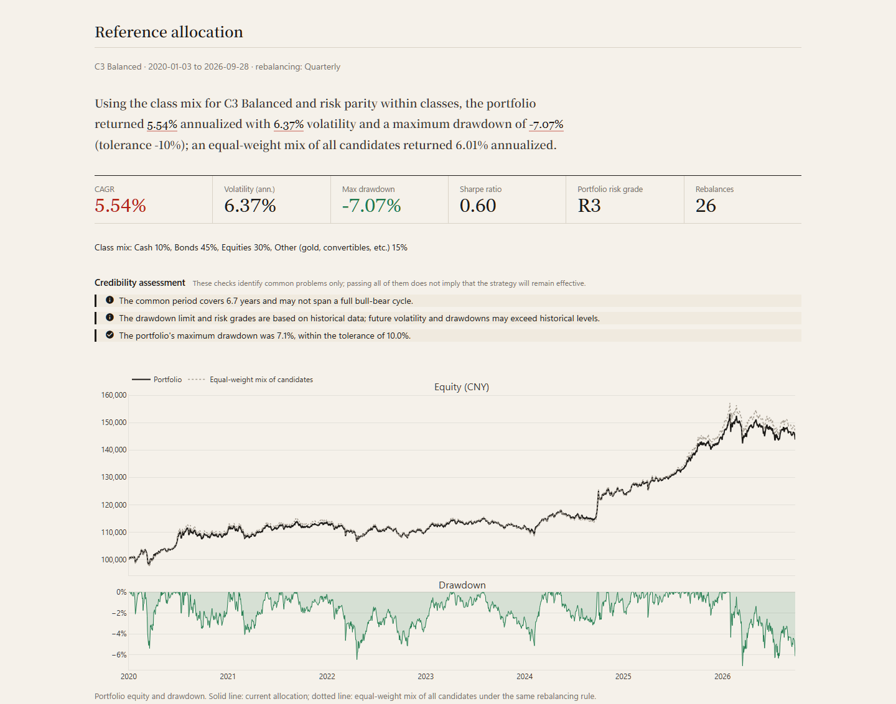

<p align="center">
  <picture>
    <source media="(prefers-color-scheme: dark)" srcset="docs/images/banner-en-dark.png">
    
  </picture>
</p>

<p align="center"><a href="README.md">简体中文</a> · <b>English</b></p>

<p align="center">Desktop app for Windows / macOS / Linux · Backtrader engine · Open source under GPLv3</p>

SimpleQuant is a low-code quant backtesting tool for China A-shares, covering stocks, ETFs (including bond ETFs) and convertible bonds. You can go from data to strategy, backtest, parameter optimization and paper trading without writing code. If you prefer, you can also write Python strategies, run multi-factor selection (stocks or convertibles), build an allocation across asset classes from a risk assessment, or export strategies to JoinQuant, MyQuant (掘金) and QMT for cross-checking.

> **Disclaimer**: This software is for learning and research only and is not investment advice. Backtest and paper-trading results do not guarantee future returns; any live trading based on them is at your own risk.

<picture>
  <source media="(prefers-color-scheme: dark)" srcset="docs/images/backtest-en-dark.png">
  
</picture>

## Three workflows

The step bar at the top of the app follows these three workflows, and each step suggests what to do next.

| Workflow | Steps |
|---|---|
| **Timing** | 01 Data — 02 Strategy — 03 Backtest — 04 Optimize — 05 Paper |
| **Stock selection** | 01 Data — 02 Selection — 03 Paper |
| **Allocation** | 01 Data — 02 Allocation |


### 01 · Data
Download into a local library with one click: AKShare daily bars (Eastmoney, with ETFs falling back to Sina when Eastmoney is unreachable), BaoStock 5–60 minute bars and stock daily bars (with PE, PB, PS and turnover), and local TDX (通达信) 1/5-minute bars. You can also import CSV files (bars, or snapshot/tick data with a `last` column, resampled to N-second/N-minute bars). ChinaBond yield curves (10-year government yield, term spread, credit spread) can be downloaded for use in timing rules.

### 02 · Strategy
Four ways to build a strategy:
- **Templates**: buy & hold, moving-average cross, RSI, Bollinger bands, momentum rotation (e.g. stocks vs. bonds), fixed-weight rebalancing (e.g. 60/40) and more — just tune the parameters.
- **Rule builder**: combine indicators such as MA, EMA, MACD, RSI, KDJ, Bollinger bands, ATR, volume ratio, valuation, rates and credit spreads, and position return with crosses above/below and comparisons; stop-losses supported.
- **Describe it in words (AI)**: e.g. "buy when MACD crosses up and RSI is below 70; sell on a cross down or an 8% loss". A large language model turns this into rules (rules only, never code) and lists anything it cannot express.
- **Write Python**: write a strategy class; board lots, T+1 and trading costs still apply, and its parameters can be optimized.

### 03 · Backtest
Multiple assets (capital split equally), custom date range and costs, and a choice of dividend handling (reinvest, or cash dividends with dividend tax). The report opens with a plain-language summary, followed by return, CAGR, Sharpe, drawdown, win rate and profit factor, plus the equity curve, trades on the price chart, P&L per trade and the full fill list; the native Backtrader chart is also available. The report also includes a **credibility assessment**: whether there are enough trades, whether returns are concentrated in a few trades, and a bootstrap range of returns.

A-share rules: 100-share board lots, T+1 by product type (stocks and domestic equity ETFs are T+1; bond, money-market, gold, commodity and cross-border ETFs and convertibles are T+0, detected from the code and name), stamp duty on sells, minimum commission and slippage. Signals form at a bar's close and fill at the next bar's open.

### 04 · Optimize
Grid search over any numeric parameter (up to 3 parameters and 500 combinations, run in parallel), with a heatmap of how results vary; the earlier part of the data picks parameters and the later part checks them out of sample, with overfitting warnings (too many combinations tested, most combinations losing money, markedly weaker out-of-sample results). Walk-forward optimization stitches together a fully out-of-sample equity curve.


### 05 · Paper trading
Open a simulated account for any saved strategy — no brokerage account needed. After each trading day's close it updates data, advances the account with **the same code as the backtest**, and lists the trades for the next open. A scheduled task (Windows Task Scheduler, macOS launchd or a Linux systemd timer) can run it automatically; the home page warns if no schedule is set, the last run failed or the data has not been updated for several days.


### Multi-factor stock selection
Using free BaoStock data, score the **historical constituents** of the CSI 300 and CSI 500 by value, momentum, low volatility, quality, growth and other factors, and rebalance on a schedule; or pick from **all convertible bonds** (including delisted ones) by double-low, premium and other factors. Includes factor research (Rank IC, quantile backtests, factor correlation), industry/size neutralization, IC/ICIR weighting, custom factors and walk-forward optimization; selection strategies can be paper traded as well.


### Asset allocation
A risk assessment modelled on broker suitability questionnaires (C1 conservative to C5 aggressive, with a maximum tolerable drawdown) leads to a reference allocation across cash, Treasury ETFs, broad-market ETFs, a gold ETF and your own timing or selection strategies: the risk level sets the class mix, risk parity splits weight within each class, and if the portfolio's historical drawdown exceeds the tolerance, weight moves to defensive assets automatically. Portfolio backtests support several rebalancing rules and show each component's return and risk contribution and the correlations; weights can be edited and re-tested.



### Export
- **Python script**: runs on its own, with fills identical to the SimpleQuant backtest.
- **JoinQuant / MyQuant / QMT**: strategy files (timing and selection) ready to import into each platform, for cross-checking results elsewhere.

The interface is available in **Chinese and English**, with light and dark themes.

## Installation

SimpleQuant runs on Windows 10 / 11 (64-bit), macOS 11 or later (Apple silicon and Intel) and Linux (x86_64). Download the file for your system from this repository's **Releases** page:

| System | File |
|---|---|
| Windows | `SimpleQuant-<version>-Setup.exe` |
| macOS (Apple silicon: M1 and later) | `SimpleQuant-<version>-macos-arm64.dmg` |
| macOS (Intel) | `SimpleQuant-<version>-macos-x86_64.dmg` |
| Linux | `SimpleQuant-<version>-linux-x86_64.tar.gz` |

After installing, download the data you need on the "01 Data" page (AKShare and BaoStock are free).

### Windows
1. Run the installer. SimpleQuant installs to `%LOCALAPPDATA%\Programs\SimpleQuant` without administrator rights and adds a Start menu shortcut (desktop shortcut optional).
2. On first launch, Windows SmartScreen may say "Windows protected your PC": click "More info → Run anyway".

### macOS
1. Open the dmg and drag SimpleQuant into the Applications folder.
2. The app is not notarized by Apple (notarization requires a paid developer account), so macOS blocks it on first launch. Allow it once, either way:
   - open System Settings → Privacy & Security, find the message about SimpleQuant near the bottom and click "Open Anyway"; or
   - run `xattr -dr com.apple.quarantine /Applications/SimpleQuant.app` in Terminal (also use this if macOS says the app "is damaged").
3. If you prefer not to run an unnotarized app, run from source instead (see below); it is just as simple.

### Linux
1. Extract and run: `tar -xzf SimpleQuant-<version>-linux-x86_64.tar.gz`, then `SimpleQuant/SimpleQuant`. Extract it somewhere in your home folder: automatic updates need write access to the program folder.
2. The Qt components for the window are included. If a minimal distribution reports missing system libraries, on Debian / Ubuntu install `sudo apt install libxcb-cursor0 libxkbcommon-x11-0 libegl1`.

### Notes
- **Automatic updates** (Windows from 0.1.1; macOS and Linux from their first release): after startup SimpleQuant checks GitHub Releases in the background and usually downloads only the files that changed. When the download is ready it asks you to restart; the files are replaced and the app reopens. If the full package is needed (over 30 MB) it asks first. Updates are verified by signature and SHA256, and a failed replacement keeps the previous version. Check manually or turn off automatic checks on the Settings page; if GitHub cannot be reached, download the new version from Releases. Windows 0.1.0 needs one manual install of a newer version.
- **Data folder** (market data, stock data, paper accounts, saved strategies, AI settings): `%LOCALAPPDATA%\SimpleQuant` on Windows, `~/Library/Application Support/SimpleQuant` on macOS, `~/.local/share/SimpleQuant` on Linux (under `XDG_DATA_HOME` if set). Upgrading and uninstalling leave it untouched. The error log is `logs/app.log` in the data folder.
- **Daily paper-trading runs**: set them up with one click on the Paper Trading page. Windows uses Task Scheduler, macOS launchd, Linux a systemd user timer (crontab when systemd is not available).
- **Command line**: `SimpleQuant --paper` advances all paper accounts without opening the window (the scheduled run uses this); `SimpleQuant --run-script picks.py` runs an exported selection script. On macOS the executable is `/Applications/SimpleQuant.app/Contents/MacOS/SimpleQuant`.
- The installed version does not include LiteLLM; for AI features use Claude, OpenAI or an OpenAI-compatible service (DeepSeek, Qwen, Kimi, Zhipu, Gemini, local Ollama, etc.).

### Run from source
Requires Python 3.10 or later (developed and tested on 3.14).
- **Windows**: double-click `start.bat`. The first run creates a virtual environment and installs dependencies, then opens the desktop window.
- **macOS / Linux**: in a terminal, go to the project folder and run `sh start.sh`; the first run sets everything up the same way.
  - The Python that ships with macOS is too old; install one from [python.org](https://www.python.org/downloads/) or Homebrew (`brew install python`).
  - On Linux the desktop window uses the system's GTK WebKit. On Debian / Ubuntu install `sudo apt install python3-venv python3-gi gir1.2-webkit2-4.1` (`start.sh` detects it and lets the virtual environment use it). Without it, SimpleQuant opens in your browser instead.
- Or manually: `python -m venv .venv`, install dependencies with `pip install -r requirements.txt`, run `python main.py` (add `--browser` to open in a browser).
- The source version keeps its data in `data_cache`, `user_strategies` and `user_factors` inside the project folder, separate from the installed version.

### Build
PyInstaller cannot cross-compile, so each system's version is built on that system. Output goes to `dist/windows`, `dist/macos` and `dist/linux`.
1. Install the build tools: `pip install pyinstaller pillow`. The Windows installer also needs [Inno Setup 6](https://jrsoftware.org/isinfo.php) (`winget install JRSoftware.InnoSetup`); Linux also needs `pip install "pywebview[qt]"` (the packaged app's window uses the bundled Qt).
2. Set the version `__version__` in `simplequant/__init__.py`.
3. Windows: double-click `build.bat` to build `dist\windows\SimpleQuant\` and the installer `SimpleQuant-<version>-Setup.exe` (see `SimpleQuant.spec` and `installer/SimpleQuant.iss`). macOS / Linux: run `sh tools/build_unix.sh` to build the `.app` and `.dmg`, or the program folder and `.tar.gz`.
4. To publish a release, use `tools/release.py`. It builds the Windows version locally, writes the update manifest (SHA256 of every file, Ed25519-signed) and patch packages, tags the commit and uploads a draft GitHub release. The tag also triggers GitHub Actions (`.github/workflows/build.yml`), which tests, builds and uploads the macOS and Linux versions; `release.py` waits for them and signs their manifests. See the top of the file. The signing key stays on the publisher's machine; the app contains only the public key.
5. The icon `gui/static/icon.ico` is generated by `tools/make_icon.py`; the README banners and screenshots by `tools/readme_assets.py` (both need Microsoft Edge).

## Features in detail

<details>
<summary><b>Multi-factor stock selection</b></summary>

- **Data**: free BaoStock data. Index constituents are queried month by month (avoiding survivorship bias); each stock's unadjusted prices and adjustment factors are downloaded (returns use back-adjusted prices, board lots use actual prices), along with suspensions, ST status, price limits, PE/PB/PS and turnover. Parallel, resumable, incremental; the first CSI 300 download takes about 8–10 minutes and 80 MB. Data packs can be exported and imported (check the data source's terms before sharing).
- **Factors**: EP, BP, SP, 5/20/60-day returns, medium-term momentum (120 days, skipping the latest 20), 60-day volatility, 20-day turnover, Amihud illiquidity, and fundamentals such as ROE, gross margin, net margin, profit/revenue growth and market cap. Daily MAD winsorization and z-scoring; multiple factors are combined by direction and weight.
- **Fundamentals**: BaoStock quarterly data, effective from the day after the first announcement; late filings for older periods never overwrite newer ones; data older than 15 months counts as missing. AKShare's earnings tables are not used because their "latest announcement date" changes with later filings, which would leak future information.
- **Factor research**: Rank IC (mean, annualized ICIR, t-stat, share of IC > 0), quantile backtests (group equity, annual returns, long-short, monotonicity, top-group turnover), an overview of all factors and a correlation matrix.
- **Neutralization**: daily cross-sectional regression removes industry (CSRC classification) and/or size exposure before standardizing.
- **IC/ICIR weighting**: each factor's weight and direction come from its average Rank IC (or IC / std) over the past N trading days, using only ICs already fully realized at the time.
- **Selection backtest**: monthly, weekly or every N days, stocks are scored at the rebalance-day close and the top N are traded at the next open; dropped stocks are sold first, then new picks are bought in equal amounts. Suspended or limit-down stocks cannot be sold (retried daily) and suspended or limit-up stocks cannot be bought; the benchmark is the corresponding index.
- **Dividends**: "reinvest" (back-adjusted) by default. "Cash dividends, taxed" pays cash on the ex-date, adds bonus shares, and deducts dividend tax on sale by holding period (≤1 month 20%, 1 month–1 year 10%, over 1 year exempt), matching JoinQuant and live trading. Special and interim dividends missing from BaoStock's dividend table are filled in from the exchange's ex-dividend reference prices.
- Also: describing a selection in words (AI), industry breakdown of each period's picks, and custom factors (write `def factor(p)` and preview coverage, IC and group returns).
</details>

<details>
<summary><b>Convertible-bond selection</b></summary>

- **Data**: Eastmoney (bond list including delisted bonds, terms, daily bond floor / conversion value / conversion price), Sina (daily bars), China Securities Index (CSI Convertible Bond Index as the benchmark). The first download covers about 1,000 bonds (about 40 MB, 6–10 minutes); later updates fetch only bonds still trading.
- **Factors**: double-low (price + conversion premium), price, conversion premium, premium over bond floor, conversion value, issue size, years to maturity, underlying-stock 20-day return and 60-day volatility; price/volume factors (returns, momentum, volatility, Amihud) are shared with stocks. Over 2018–2026, double-low has a 20-day Rank IC of about −0.06 (t ≈ −3.3) with monotonic quintile returns.
- **Filters**: max price, minimum 20-day average turnover, minimum years to maturity, max conversion premium.
- **Trading rules**: lots of 10 bonds, T+0; ±20% price limits from 2022-08-01, +57.3% / −43.3% of par on the first day; convertibles trade at full price, and coupons are added after 20% tax as an adjustment factor.
- **Calls and maturity**: once a forced-redemption or maturity notice is published the bond is no longer selected and holdings are sold at the next open; bonds that stop trading unexpectedly (suspension, default, stock delisting) cannot be sold and stay at their last price, as in reality.
- Industry neutralization uses the underlying stock's industry; size neutralization uses issue size. Factor research, backtests, walk-forward, paper trading, Python script export and natural-language selection all work; export to JoinQuant / MyQuant / QMT is not supported, and conversion, puts and reset plays are not simulated.
- Trading convertibles requires investor suitability (since 2022: 100k CNY average assets over the previous 20 trading days and 2 years of trading experience).
</details>

<details>
<summary><b>Asset allocation</b></summary>

- **Risk assessment**: 10 single-choice questions (age, income, share of assets to invest, income stability, experience, riskiest product held, horizon, objective, largest tolerable loss, reaction to a 20% fall). The total score's position between the minimum and maximum maps to C1-C5 in five equal bands; "no loss at all" caps the rating at C1 and a horizon under one year caps it at C2. The maximum tolerable drawdown has five bands: 3%, 10%, 20%, 35% and 50%.
- **Candidates**: cash (a fixed annual rate), buy-and-hold ETFs, a timing strategy on an asset, or a saved selection strategy. Built-in candidates are cash, a Treasury ETF (511010), a 10-year Treasury ETF (511260), CSI 300 and CSI 500 ETFs and a gold ETF (518880); missing data can be downloaded with one click. Each candidate's risk grade R1-R5 comes from its annualized volatility (2% / 6% / 15% / 25%) and maximum drawdown (3% / 10% / 20% / 35%) over the common period, taking the higher grade; the drawdown bands match C1-C5.
- **Reference allocation**: the risk level sets the shares of cash, bonds, equities and other assets (gold, convertibles, etc.), with missing classes redistributed proportionally; within each class, weights are inversely proportional to volatility (risk parity). Mean-variance optimization is not used because it is highly sensitive to errors in expected returns. If the portfolio's maximum drawdown over the common period exceeds the tolerance, 5% of the weight moves at a time from equities and other assets to bonds, then from bonds to cash, until the limit is met.
- **Portfolio backtest**: component daily returns are combined by weight, with monthly, quarterly, yearly, threshold (5 percentage points) or no rebalancing; each rebalance costs 0.05% of the traded amount. An equal-weight mix of all candidates serves as the reference. Results include CAGR, volatility, maximum drawdown, Sharpe, the portfolio risk grade, return and risk contributions, correlations, and notes on the length of the common period, whether the drawdown limit holds and whether the portfolio grade exceeds the risk tolerance.
- The drawdown limit and risk grades rely on historical data; future volatility and drawdowns may be larger. Results are for research only.
</details>

<details>
<summary><b>Backtest charts</b></summary>

- **Interactive strategy chart**: mirrors the native Backtrader chart but supports zoom, pan and linked hover: P&L per trade, price (with indicators and trades), volume and indicator panels share one time axis; quick ranges 1M/3M/6M/1Y/All; non-trading days removed. Rule strategies plot the indicator lines actually used by the rules, plus threshold reference lines.
- **Native Backtrader chart**: Backtrader's own matplotlib chart, with a selectable range and PNG download; it shares the backtest's setup, and tests ensure its fills match the backtest exactly.
</details>

<details>
<summary><b>Walk-forward optimization</b></summary>

- Splits the data into training/testing windows (rolling: fixed training length; anchored: growing from the earliest data). Each window picks parameters on its training period only and is tested on the period right after it, producing a fully out-of-sample equity curve compared with "original parameters throughout" and buy & hold.
- When parameters change: **carry positions over** (as if the new parameters had always been running) or **restart each segment** (start each segment flat and pass the capital on; more conservative).
- Reports out-of-sample return, CAGR, Sharpe, drawdown, walk-forward efficiency (WFE), a parameter-stability chart and per-window details. Works for timing and selection strategies.
</details>

<details>
<summary><b>Paper trading</b></summary>

- Each run: update data → replay the strategy from the start date with the backtest code → append new fills to the ledger (append-only) → orders placed on the last bar but not yet filled are the "signals" for the next open. Tests ensure day-by-day progress matches a single full backtest exactly.
- Uses only complete daily bars that "should have been published by now", so unfinished intraday bars are never used; missed trading days are caught up on the next run; the trading calendar includes holidays.
- Single-asset accounts can use cash dividends, with signal share counts based on actual prices; selection accounts follow the selection strategy's dividend setting.
- Signals and positions export to CSV for manual orders at a broker; you are warned if revised data makes the replay differ from the ledger.
- Scheduled task: Monday to Friday, 19:00 by default (BaoStock usually publishes the day's data by 18:40); the source version runs `paper_daily.bat` (`paper_daily.sh` on macOS / Linux), the installed version `SimpleQuant --paper`.
</details>

<details>
<summary><b>Exporting strategies</b></summary>

- **Timing → Python script**: a standalone `.py` (needs only `backtrader pandas akshare baostock`) with the data setup, strategy and costs; tests ensure every fill matches the SimpleQuant backtest.
- **Timing → JoinQuant / MyQuant / QMT**: embeds a platform-independent signal core, `simplequant/export/signal_core.py` (pure numpy, Python 3.6 compatible, indicators and warm-up checked item by item against Backtrader), plus a thin adapter per platform. Same timing as SimpleQuant: signals at the previous close, fills at the next open. Verified on JoinQuant: trade dates match SimpleQuant.
- **Selection → export**: a Python script (update data → backtest → save the latest picks to `picks.csv`; can be scheduled); "computed on the platform" versions for JoinQuant / MyQuant / QMT (the platform's own data, same algorithm) and "follow SimpleQuant's list" versions (each period's picks written into the file). Verified on JoinQuant: fills match one for one.
- JoinQuant and MyQuant backtests only need a free account; QMT requires a brokerage account. Not yet supported: valuation/turnover/rates factors in timing rules, minute bars, and convertible-bond selection (rates conditions can't be exported as Python scripts either).
</details>

<details>
<summary><b>Timing indicators</b></summary>

Price: close/open/high/low, N-day high/low; trend: MA, EMA, MACD, MA slope, BIAS, DMI/ADX, N-day return; oscillators: RSI, KDJ, CCI, Williams %R; volume: volume, average volume, volume ratio, OBV; volatility: Bollinger bands, ATR, return volatility; valuation/turnover: turnover, PE (TTM), PB, PS (TTM) (needs BaoStock stock daily bars); rates/credit: 10-year government yield, term spread (10Y − 1Y), credit spread (3Y AAA medium-term notes − 3Y government) from the ChinaBond curves, downloaded on the Data page first; position: position return (take-profit/stop-loss). KDJ and OBV follow the formulas used by Chinese trading software and are checked value by value against independent implementations.
</details>

<details>
<summary><b>About the data sources</b></summary>

- AKShare ETF daily bars come from Eastmoney. If Eastmoney is unreachable, ETFs switch to Sina prices plus Sina's cumulative dividends to rebuild adjusted prices (matching Eastmoney's back-adjusted prices day by day); adjusted stock prices still require Eastmoney.
- Eastmoney's back-adjustment is additive (adjusted price = raw price + cumulative dividends), which slightly understates long-run returns compared with proportional adjustment; BaoStock uses proportional adjustment. Keep this in mind when comparing results across sources.
- BaoStock publishes the day's bars after the close (by 18:40 in our tests).
- Convertibles: Sina bars are unadjusted with volume in bonds; a few bonds lack bars for their first months (those days use Eastmoney closes for factors only and are not traded). Eastmoney's rating is the latest one, which would introduce look-ahead bias in backtests, so it is not offered as a filter.
- Rates: the ChinaBond curves can be queried about a year at a time; there is no corporate-bond curve, so the credit spread uses AAA medium-term notes. Curves are published in the evening, so daily strategies use the same day's value (fills happen at the next open) and minute strategies use the previous day's.
</details>

<details>
<summary><b>Project layout and extending</b></summary>

```
main.py                    entry point (desktop window / --browser / --paper / --run-script)
gui/                       UI (NiceGUI): app (routes), layout (header and step bar), pages/, components, widgets, theme
ui/                        framework-independent parts: texts (UI strings), charts, shared (page logic)
simplequant/data/          data sources (akshare / baostock / tdx_local / csv), local library, cash-dividend prices
simplequant/engine/        backtest runner, A-share cost model, strategy base (lots / T+1 / dividends), metrics, optimization, walk-forward, credibility checks
simplequant/strategies/    templates, rule strategies, code strategies
simplequant/rules/         rule JSON schema, validation and descriptions
simplequant/stocks/        stock selection: downloads, panels, factors, research, selection backtest, dividends, universe entry point
simplequant/bonds/          convertible-bond data and panels, rates and credit spreads
simplequant/paper/         paper trading: accounts, replay and ledger, trading calendar, scheduled task, health checks
simplequant/allocation/    asset allocation: risk assessment, candidates and risk grades, reference allocation, portfolio backtest
simplequant/export/        export: Python scripts, JoinQuant / MyQuant / QMT
simplequant/llm/           LLM access: presets and config, Claude / OpenAI / LiteLLM adapters, natural language to rules
simplequant/update/        automatic updates: check and download, signed manifest verification, file replacement script
installer/                 installer script (Inno Setup)
tools/                     release (release.py), macOS / Linux builds (build_unix.sh, smoke_test.py), icon, README images and other helper scripts
.github/workflows/         GitHub Actions: macOS / Linux tests and builds
tests/                     pytest
```

- **New data source**: subclass `simplequant.data.base.DataSource`, implement `fetch()` returning a standard OHLCV DataFrame, and add it to `SOURCES` in `simplequant/data/__init__.py`.
- **New template**: subclass `_PerAsset` or `BaseStrategy` in `simplequant/strategies/templates.py` and register it with `register(Template(...))`; the UI builds the parameter form automatically.
- **New indicator**: describe it in `INDICATORS` in `rules/schema.py` and implement it in `_build_line` in `strategies/rule_strategy.py`.
- **UI strings**: UI text lives in `ui/texts.py` and core text (indicator names, logs, errors) in `simplequant/i18n.py`, written as `L("中文", "English")`; tests check that every key in use has both languages.
- **Platform differences**: data folder, program folder, opening folders etc. live in `simplequant/system.py`; scheduled runs in `simplequant/paper/schedule.py`; the update scripts are `simplequant/update/apply_update.ps1` (Windows) and `apply_update.sh` (macOS / Linux).
- **Tests**: `.venv\Scripts\python -m pytest -q tests` (macOS / Linux: `.venv/bin/python -m pytest -q tests`)
</details>

## License

SimpleQuant is released under the [GNU General Public License v3.0](LICENSE) (GPLv3): you may use, modify and redistribute it freely, but any redistribution (including modified versions or packaged builds) must provide the complete source under the same license. GPLv3 is used because the backtest engine, Backtrader, is licensed under GPLv3.

## Third-party components

- Main dependencies: [Backtrader](https://github.com/mementum/backtrader) (GPLv3+), [NiceGUI](https://nicegui.io) (MIT), [pywebview](https://pywebview.flowrl.com) (BSD), [AKShare](https://github.com/akfamily/akshare) (MIT), [BaoStock](http://baostock.com) (BSD), [mootdx](https://github.com/mootdx/mootdx) (MIT), pandas / NumPy (BSD), Plotly (MIT), PyArrow (Apache-2.0), Anthropic / OpenAI SDKs (MIT / Apache-2.0). Their licenses ship with each package.
- Fonts: Inter, JetBrains Mono and Noto Serif SC (GB2312 subset) are under the SIL Open Font License; license texts are in `gui/static/fonts/`.
- The installer is built with [Inno Setup](https://jrsoftware.org/isinfo.php); the Simplified Chinese messages file `installer/ChineseSimplified.isl` is an unofficial translation from the Inno Setup repository.
- Data: market data from AKShare, BaoStock, TDX and others belongs to the respective providers. This repository contains no market data; check each source's terms before exporting or sharing data packs.
