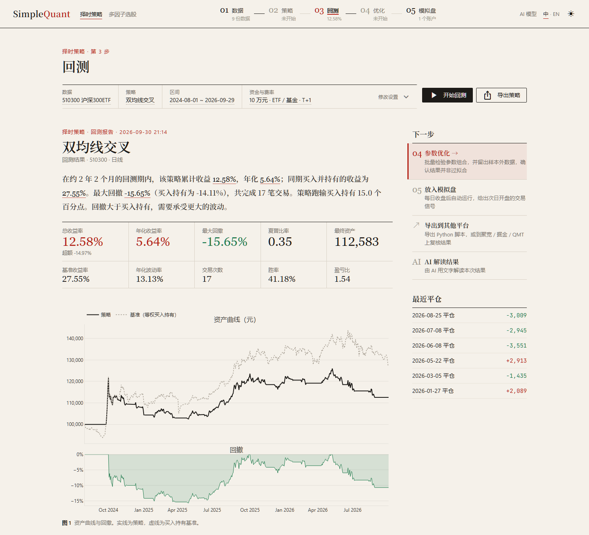
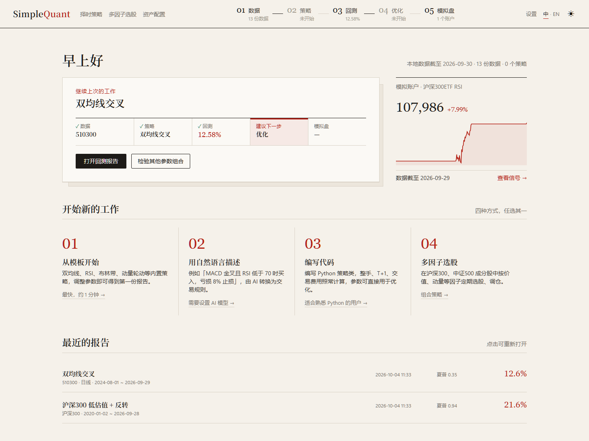
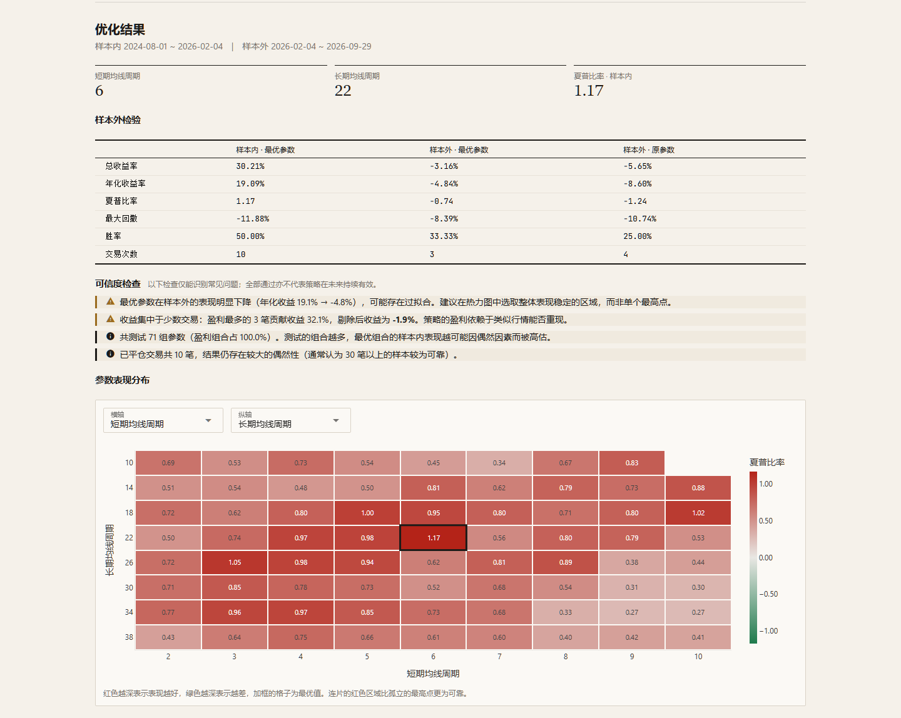
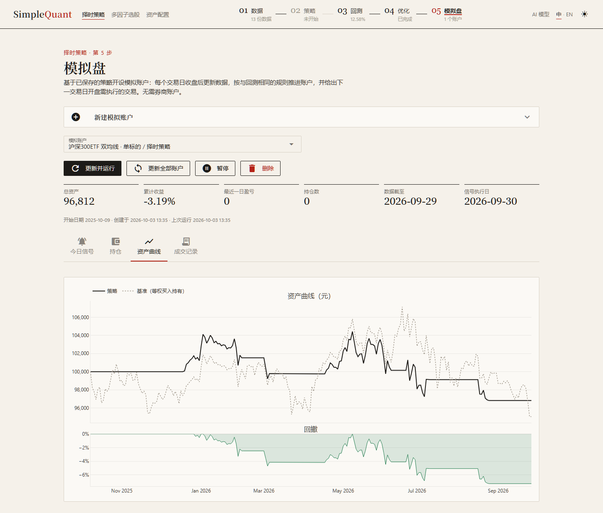
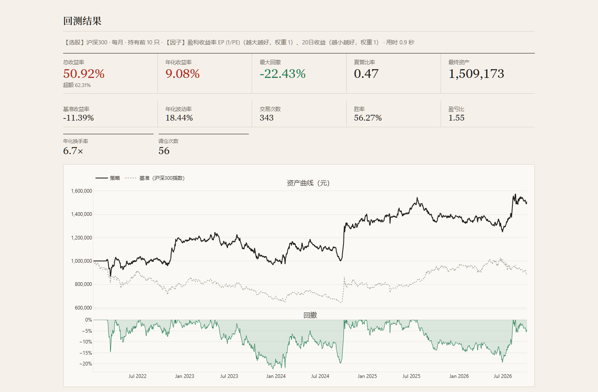
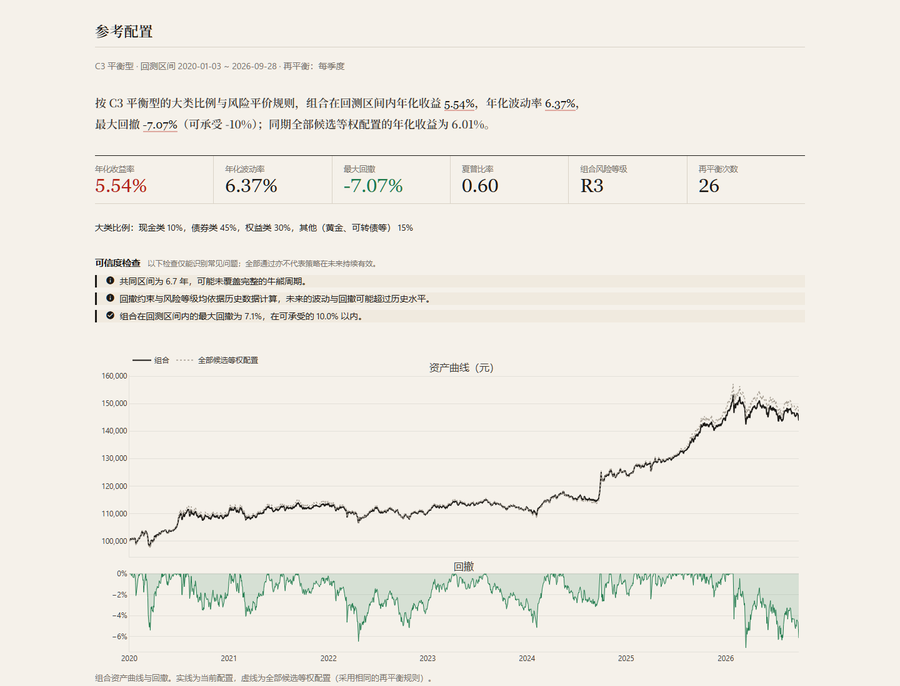

<p align="center">
  <picture>
    <source media="(prefers-color-scheme: dark)" srcset="docs/images/banner-zh-dark.png">
    
  </picture>
</p>

<p align="center"><b>简体中文</b> · <a href="README.en.md">English</a></p>

<p align="center">Windows / macOS / Linux 桌面程序 · 回测引擎 Backtrader · GPLv3 开源</p>

SimpleQuant 是面向 A 股的低代码量化回测工具，覆盖股票、ETF（含债券 ETF）与可转债。通过点选即可完成「准备数据 → 搭建策略 → 回测 → 参数优化 → 模拟盘」的完整流程；需要时也可以直接编写 Python 策略、进行多因子选股（股票或可转债）、根据风险测评在多类资产之间进行配置，或将策略导出到聚宽、掘金、QMT 复核。

> **免责声明**：本软件仅供学习与研究使用，不构成任何投资建议。回测与模拟盘结果不代表未来收益；据此进行实盘交易的风险由使用者自行承担。

<picture>
  <source media="(prefers-color-scheme: dark)" srcset="docs/images/backtest-zh-dark.png">
  
</picture>

## 三条工作流程

软件顶部的步骤条与下面三条流程一一对应，每一步完成后都会给出建议的下一步。

| 流程 | 步骤 |
|---|---|
| **择时策略** | 01 数据 — 02 策略 — 03 回测 — 04 优化 — 05 模拟盘 |
| **多因子选股** | 01 数据 — 02 选股 — 03 模拟盘 |
| **资产配置** | 01 数据 — 02 资产配置 |



### 01 · 数据
AKShare 日线（东方财富；连接失败时 ETF 自动改用新浪）、BaoStock 5～60 分钟线与股票日线（含 PE、PB、PS、换手率）、通达信本地 1 / 5 分钟线，一键下载到本地数据库；也可导入 CSV（K 线，或含 `last` 列的快照 / Tick，自动合成 N 秒 / N 分钟 K 线）。另可下载中债收益率曲线（10 年期国债收益率、期限利差、信用利差），用于择时规则。

### 02 · 策略
四种方式，任选其一：
- **策略模板**：买入持有、双均线、RSI、布林带、动量轮动（可做股债轮动）、定比再平衡（如股债 60/40）等，调整参数即可使用。
- **条件组件**：以 MA、EMA、MACD、RSI、KDJ、布林带、ATR、量比、估值、利率与信用利差、持仓收益率等指标，配合上穿 / 下穿 / 大于 / 小于组合买卖规则，可设止损。
- **自然语言描述（AI）**：例如「MACD 金叉且 RSI 低于 70 时买入，死叉或亏损超过 8% 卖出」，由大模型转换为规则（只生成规则，不生成代码），并列出无法表达的部分。
- **编写代码**：编写 Python 策略类，整手、T+1、交易费用照常计算，参数可直接用于优化。

### 03 · 回测
支持多标的（资金平均分配）、自选区间与费率；分红可选「分红再投资」或「现金分红并扣红利税」。报告先给出结论段落，再列出收益、年化、夏普、回撤、胜率、盈亏比，以及资产曲线、K 线买卖点、每笔交易盈亏和成交明细，并提供 Backtrader 原生图。报告还会进行**可信度检查**：交易次数是否足够、收益是否集中于少数交易、按交易重抽样的收益区间。配置大模型后，可由 AI 解读结果：先将年化收益与无风险收益比较，再参照夏普、卡玛比率的常用区间评价，基准下跌时说明超额收益的来源。

A 股交易规则：100 股整手、按品种执行 T+1（股票与境内股票 ETF 为 T+1；债券、货币、黄金、商品、跨境 ETF 及可转债为 T+0，按代码和名称自动判断）、卖出印花税、最低佣金、滑点；信号在 K 线收盘时产生，下一根 K 线开盘成交。

### 04 · 参数优化
对任意数值参数进行网格搜索（最多 3 个参数、500 组，多进程并行），以热力图查看参数表现的分布；以前段数据选择参数、后段数据做样本外检验，并提示过拟合（测试的组合过多、多数组合亏损、样本外表现明显下降等）。另提供滚动优化（Walk-forward），拼接出完全样本外的资产曲线。



### 05 · 模拟盘
以已保存的策略开设模拟账户，无需券商账户。每个交易日收盘后更新数据，以**与回测相同的代码**推进账户，并给出下一交易日开盘需执行的交易；可设置定时任务每日自动运行（Windows、macOS、Linux 均支持）；尚未设置定时任务、上次运行失败或数据多日未更新时，首页会给出提示。



### 多因子选股
基于 BaoStock 免费数据，在沪深300、中证500 的**历史成分股**中按价值、动量、低波动、质量、成长等因子评分，定期调仓；也可以在**全部可转债**（含已退市的）中按双低、溢价率等因子选债。提供因子研究（Rank IC、分层回测、因子相关性）、行业 / 市值中性化、IC / ICIR 加权、自定义因子与滚动优化；可以用一句话描述选股思路，再在当前方案基础上逐步修改（AI）；选股策略同样可以开设模拟账户。



### 资产配置
参照证券公司投资者适当性管理的问卷进行风险测评（C1 保守型 ～ C5 进取型，并给出可承受的最大回撤），在现金、国债 ETF、宽基 ETF、黄金 ETF 以及自己的择时 / 选股策略之间给出参考配置：按风险等级确定大类比例，大类内部按风险平价分配，组合历史回撤超过可承受范围时自动提高稳健资产的比例。组合回测支持多种再平衡方式，并列出各成分的收益贡献、风险贡献与相关系数；权重可以手动调整后重新回测。



### 导出
- **Python 脚本**：可独立运行，成交与 SimpleQuant 回测逐笔一致。
- **聚宽 / 掘金 / QMT**：生成可直接导入平台的策略文件（择时与选股），用于在其他平台复核结果。

界面支持**中文 / English**，并提供浅色与深色主题。

## 安装

支持 Windows 10 / 11（64 位）、macOS 11 及以上（Apple 芯片与 Intel 芯片）、Linux（x86_64）。在本仓库的 **Releases** 页面下载对应的文件：

| 系统 | 文件 |
|---|---|
| Windows | `SimpleQuant-<版本>-Setup.exe` |
| macOS（Apple 芯片：M1 及以后） | `SimpleQuant-<版本>-macos-arm64.dmg` |
| macOS（Intel 芯片） | `SimpleQuant-<版本>-macos-x86_64.dmg` |
| Linux | `SimpleQuant-<版本>-linux-x86_64.tar.gz` |

安装后，在「01 数据」页下载所需数据（AKShare、BaoStock 均为免费数据源）。

### Windows
1. 运行安装程序。程序安装到 `%LOCALAPPDATA%\Programs\SimpleQuant`，无需管理员权限，并创建开始菜单快捷方式（桌面快捷方式可选）。
2. 首次运行时 Windows SmartScreen 可能提示「已保护你的电脑」，请点击「更多信息 → 仍要运行」。

### macOS
1. 打开 dmg，将 SimpleQuant 拖入「应用程序」文件夹。
2. 本程序未经 Apple 公证（公证需要付费的开发者账号），首次打开时系统会阻止运行。放行方法（任选其一，只需一次）：
   - 打开「系统设置 → 隐私与安全性」，在页面下方找到关于 SimpleQuant 的提示，点击「仍要打开」；
   - 或在终端运行：`xattr -dr com.apple.quarantine /Applications/SimpleQuant.app`（提示「已损坏，无法打开」时也用此方法）。
3. 如不希望运行未经公证的程序，也可以从源码运行（见下文），步骤同样简单。

### Linux
1. 解压后运行：`tar -xzf SimpleQuant-<版本>-linux-x86_64.tar.gz`，然后执行 `SimpleQuant/SimpleQuant`。建议解压到用户目录下（自动更新需要能写入程序所在的文件夹）。
2. 界面所需的 Qt 组件已内置。较精简的发行版如提示缺少系统库，Debian / Ubuntu 可安装：`sudo apt install libxcb-cursor0 libxkbcommon-x11-0 libegl1`。

### 说明
- **自动更新**（Windows 0.1.1 起；macOS、Linux 自首个版本起）：程序启动后在后台检查 GitHub Releases 上的新版本，通常只下载有变化的文件；下载完成后提示重启，重启时替换文件并自动重新打开。需要下载完整安装包（超过 30 MB）时先询问。更新文件经签名与 SHA256 校验，替换失败时保留原版本。可在「设置」页手动检查或关闭自动检查；无法连接 GitHub 时，可在 Releases 页面手动下载新版本。Windows 0.1.0 需手动安装一次新版本。
- **数据目录**（行情库、选股数据、模拟账户、保存的策略、AI 模型设置）：Windows 为 `%LOCALAPPDATA%\SimpleQuant`，macOS 为 `~/Library/Application Support/SimpleQuant`，Linux 为 `~/.local/share/SimpleQuant`（设置了 `XDG_DATA_HOME` 时位于其下）。升级与卸载均不会删除这些数据。报错日志位于数据目录下的 `logs/app.log`。
- **模拟盘每日自动运行**：在「模拟盘」页一键设置。Windows 使用任务计划程序，macOS 使用 launchd，Linux 使用 systemd 用户定时器（没有 systemd 时使用 crontab）。
- **命令行**：`SimpleQuant --paper` 不打开界面、直接推进全部模拟账户（定时任务即使用此命令）；`SimpleQuant --run-script 选股.py` 运行导出的选股脚本。macOS 上的可执行文件为 `/Applications/SimpleQuant.app/Contents/MacOS/SimpleQuant`。
- 安装版不含 LiteLLM，AI 模型请使用 Claude、OpenAI 或兼容 OpenAI 协议的服务（DeepSeek、通义千问、Kimi、智谱、Gemini、本地 Ollama 等）。

### 从源码运行
需要 Python 3.10 及以上版本（开发和测试使用 3.14）。
- **Windows**：双击 `start.bat`：首次运行时自动创建虚拟环境并安装依赖，之后打开桌面窗口。
- **macOS / Linux**：在终端进入项目目录，运行 `sh start.sh`，首次运行同样自动完成安装。
  - macOS 系统自带的 Python 版本过低，请从 [python.org](https://www.python.org/downloads/) 或 Homebrew（`brew install python`）安装。
  - Linux 的桌面窗口使用系统的 GTK WebKit，Debian / Ubuntu 需安装：`sudo apt install python3-venv python3-gi gir1.2-webkit2-4.1`（`start.sh` 检测到后会让虚拟环境使用它）。缺少时程序自动改为在浏览器中打开。
- 也可手动执行：`python -m venv .venv`，安装依赖 `pip install -r requirements.txt`，运行 `python main.py`（加 `--browser` 在浏览器中打开）。
- 源码版的数据保存在项目目录下的 `data_cache`、`user_strategies`、`user_factors`，与安装版相互独立。

### 打包
PyInstaller 不能跨系统打包，各系统的版本需在该系统上生成，输出分别位于 `dist/windows`、`dist/macos`、`dist/linux`。
1. 安装打包工具：`pip install pyinstaller pillow`；Windows 制作安装包另需 [Inno Setup 6](https://jrsoftware.org/isinfo.php)（`winget install JRSoftware.InnoSetup`），Linux 另需 `pip install "pywebview[qt]"`（安装版的窗口使用内置的 Qt）。
2. 修改 `simplequant/__init__.py` 中的版本号 `__version__`。
3. Windows：双击 `build.bat`，生成 `dist\windows\SimpleQuant\` 与安装包 `SimpleQuant-<版本>-Setup.exe`（配置见 `SimpleQuant.spec`、`installer/SimpleQuant.iss`）。macOS / Linux：运行 `sh tools/build_unix.sh`，生成 `.app` 与 `.dmg`，或程序文件夹与 `.tar.gz`。
4. 发布新版本使用 `tools/release.py`：在本机打包 Windows 版，生成更新清单（每个文件的 SHA256，Ed25519 签名）与补丁包，打标签并上传为 GitHub Releases 草稿；标签同时触发 GitHub Actions（`.github/workflows/build.yml`）在 macOS 与 Linux 上测试、打包并上传，`release.py` 等待完成后为这些平台的清单签名。用法见文件开头。签名私钥只保存在发布者本机，程序内置对应的公钥。
5. 图标 `gui/static/icon.ico` 由 `tools/make_icon.py` 生成；README 中的横幅与截图由 `tools/readme_assets.py` 生成（均需要 Microsoft Edge）。

## 功能详解

<details>
<summary><b>多因子选股</b></summary>

- **数据**：BaoStock 免费数据。按月查询历史成分股（避免幸存者偏差）；个股下载不复权价与复权因子（收益使用后复权价，整手按真实价格计算），包含停牌、ST、涨跌停、PE / PB / PS、换手率。多进程并行、断点续传、增量更新；沪深300 首次下载约 8～10 分钟、约 80 MB。支持导出 / 导入数据包（分发前请确认数据源条款）。
- **因子**：EP、BP、SP、5 / 20 / 60 日收益、中期动量（120 日，跳过最近 20 日）、60 日波动率、20 日换手率、Amihud 非流动性，以及 ROE、毛利率、净利率、净利润 / 营收同比、总市值等财务因子。按日 MAD 去极值、z-score 标准化，多因子按方向与权重合成。
- **财务数据**：来自 BaoStock 季频数据，自首次公告日的下一个自然日起生效；迟到的旧报告期不覆盖新报告期；超过 15 个月未更新视为缺失。未使用 AKShare 业绩报表，因其「最新公告日期」会随后续报告更新，可能引入未来信息。
- **因子研究**：Rank IC（均值、年化 ICIR、t 值、IC>0 比例）、分层回测（各组净值、年化收益、多空组合、单调性、顶组换手）、全部因子一览、因子相关性矩阵。
- **中性化**：逐日横截面回归，去除行业（证监会分类）和 / 或市值暴露后再标准化。
- **IC / ICIR 加权**：各因子的权重与方向取过去 N 个交易日的平均 Rank IC（或 IC / 标准差），仅使用当时已完全实现的 IC。
- **选股回测**：每月 / 每周 / 每 N 天在调仓日收盘评分，选出前 N 只，次日开盘执行；先卖出落选股票，再等额买入新入选股票；停牌或开盘跌停无法卖出（此后每日重试），停牌或开盘涨停无法买入；基准为对应指数。
- **分红处理**：默认「分红再投资」（后复权）。可选「现金分红并扣红利税」：除息日现金到账、送转增加股数，卖出时按持股期限扣缴红利税（≤1 个月 20%，1 个月至 1 年 10%，超过 1 年免税），与聚宽及实盘一致。BaoStock 分红表中缺失的特别分红、中期分红根据交易所除权参考价补齐。
- 另有：以自然语言描述选股（AI，可勾选「在当前方案基础上修改」，如「加入低波动因子，持股数量改为 30 只」，仅调整所述部分，其余设置保持不变）、选股回测结果的 AI 解读、每期选股的行业分布、自定义因子（编写 `def factor(p)`，可试算覆盖率、IC 与分组收益）。
</details>

<details>
<summary><b>可转债选股</b></summary>

- **数据**：东方财富（转债列表含已退市的、条款、每日纯债价值 / 转股价值 / 转股价）、新浪（日线）、中证指数公司（中证转债指数，作为基准）。首次下载约 1000 只、约 40 MB、6～10 分钟，之后只更新仍在交易的转债。
- **因子**：双低（价格 + 转股溢价率）、转债价格、转股溢价率、纯债溢价率、转股价值、发行规模、剩余期限、正股 20 日涨幅、正股 60 日波动率；收益、动量、波动率、Amihud 等价量因子与股票通用。2018–2026 年实测双低 20 日 Rank IC 约 −0.06（t ≈ −3.3），五组收益单调。
- **选股条件**：价格上限、20 日日均成交额下限、剩余期限下限、转股溢价率上限。
- **交易规则**：每手 10 张、T+0；2022-08-01 起涨跌幅 ±20%，上市首日 +57.3% / −43.3%（相对面值）；转债按全价交易，付息按税后利息（扣 20%）计入复权。
- **强赎与到期**：发布强制赎回或到期赎回公告的转债，公告当日起不再入选，下一个交易日开盘卖出；因停牌、违约、正股退市等意外停止交易的，当时无法预知，持仓保留、无法卖出（与实际一致）。
- 行业中性化使用正股所属行业，市值中性化使用发行规模。因子研究、选股回测、滚动优化、模拟盘、导出 Python 脚本、自然语言选股均支持；暂不支持导出到聚宽 / 掘金 / QMT，也不模拟转股、回售与下修。
- 可转债开户有投资者适当性要求（2022 年起：前 20 个交易日日均资产不低于 10 万元，且有 2 年以上证券交易经验）。
</details>

<details>
<summary><b>资产配置</b></summary>

- **风险测评**：10 道单选题（年龄、收入、拟投资比例、收入稳定性、投资经验、投资过的品种、投资期限、投资目标、可承受的最大亏损、下跌 20% 时的处理）。总分在最低分与最高分之间的相对位置按五等分对应 C1～C5；「不能接受任何亏损」最高评为 C1，「投资期限 1 年以内」最高评为 C2。可承受的最大回撤分为 3%、10%、20%、35%、50% 五档。
- **配置候选**：现金类（按固定年化收益率计息）、ETF 买入持有、择时策略 + 标的、已保存的选股策略。内置候选为现金、国债 ETF（511010）、十年国债 ETF（511260）、沪深300ETF、中证500ETF、黄金 ETF（518880），缺少行情时可一键下载。各候选的风险等级 R1～R5 由共同区间内的年化波动率（2% / 6% / 15% / 25%）与最大回撤（3% / 10% / 20% / 35%）分档，取较高的一级；回撤分档与 C1～C5 一致。
- **参考配置**：按风险等级确定现金类、债券类、权益类与其他（黄金、可转债等）的比例，候选中缺少的大类按比例分摊；大类内部按波动率倒数分配（风险平价）。未使用均值-方差优化：它对预期收益的估计误差极为敏感。组合在共同区间内的最大回撤超过可承受回撤时，每次将 5% 的权重从权益类及其他移至债券类，其次由债券类移至现金类，直到满足约束。
- **组合回测**：各成分的日收益按权重合成，可选每月、每季度、每年、偏离超过 5 个百分点时或不再平衡，每次再平衡按换手金额的 0.05% 扣除成本；以全部候选等权配置为参照。结果包括年化收益、波动率、最大回撤、夏普、组合风险等级、各成分的收益贡献与风险贡献、相关系数，以及共同区间长度、回撤是否超限、组合等级是否高于风险承受能力等提示。
- 回撤约束与风险等级均依据历史数据，未来的波动与回撤可能超过历史水平；页面结果仅供研究参考。
</details>

<details>
<summary><b>回测图表</b></summary>

- **交互式策略图**：对应 Backtrader 原生图，但可缩放、拖动、悬停联动：每笔交易盈亏、K 线（叠加指标与买卖点）、成交量及各指标栏共用时间轴；提供 1 月 / 3 月 / 6 月 / 1 年 / 全部快捷区间，并去除非交易日空白。规则策略绘制规则中实际使用的指标线及阈值参考线。
- **Backtrader 原生图**：Backtrader 自带的 matplotlib 图表，可选择显示区间并下载 PNG；与回测共用同一套设置，测试保证画图时的成交与回测完全一致。
</details>

<details>
<summary><b>滚动优化（Walk-forward）</b></summary>

- 按训练期 / 测试期切分窗口（滚动：训练期长度固定；锚定：从最早数据开始逐渐变长）。每个窗口仅用训练期选择参数，在紧随其后的测试期检验，拼接出完全样本外的资产曲线，并与「始终使用原参数」「买入持有」对比。
- 更换参数时的衔接方式：**延续持仓**（视为新参数一直在运行）或**每段重新开始**（每段空仓起步、资金接力，更为保守）。
- 输出样本外收益、年化、夏普、回撤、滚动效率 WFE、参数稳定性图与各窗口明细。择时策略与选股策略均支持。
</details>

<details>
<summary><b>模拟盘</b></summary>

- 每次运行：更新数据 → 以回测代码从开始日重放到最新数据 → 新成交追加到账本（只追加、不改写）→ 最后一根 K 线上尚未成交的委托即为「今日信号」（下一交易日开盘执行）。测试保证逐日推进与一次性回测的结果完全一致。
- 仅使用「此刻应已发布」的完整日线，避免使用盘中未走完的 K 线；错过的交易日在下次运行时自动补齐；交易日历包含节假日。
- 单标的账户可选「现金分红」，信号股数按真实价格计算；选股账户跟随选股策略的分红设置。
- 今日信号与持仓可导出 CSV，用于在券商端手动下单；数据修订导致重放与账本不一致时会给出提示。
- 定时任务：周一至周五，默认 19:00（BaoStock 当日数据通常在 18:40 前发布）；源码版运行 `paper_daily.bat`（macOS / Linux 为 `paper_daily.sh`），安装版运行 `SimpleQuant --paper`。
</details>

<details>
<summary><b>导出策略</b></summary>

- **择时「导出 Python 脚本」**：生成可独立运行的 `.py`（仅需 `backtrader pandas akshare baostock`），包含数据设置、策略与费率；测试保证每一笔成交都与 SimpleQuant 回测相同。
- **择时「导出到聚宽 / 掘金 / QMT」**：嵌入与平台无关的信号核心 `simplequant/export/signal_core.py`（纯 numpy，兼容 Python 3.6，指标算法与预热期逐项对照 Backtrader），加上各平台的对接代码。时序与 SimpleQuant 相同：上一交易日收盘产生信号，当日开盘成交。聚宽已实测，交易日期与 SimpleQuant 一致。
- **选股「导出策略」**：Python 脚本（更新数据 → 回测 → 保存最新选股 `picks.csv`，可定时运行）；聚宽 / 掘金 / QMT 的「平台计算」版本（在平台上以其自身数据按相同算法选股）与「按 SimpleQuant 名单调仓」版本（写入回测得出的每期名单）。聚宽已实测，成交逐笔对应。
- 聚宽、掘金免费注册即可回测；QMT 需要券商账户。暂不支持：择时规则中的估值 / 换手 / 利率类因子、分钟线、可转债选股（利率条件也不能导出为 Python 脚本）。
</details>

<details>
<summary><b>择时因子</b></summary>

价格：收盘 / 开盘 / 最高 / 最低、前 N 日最高 / 最低；趋势：MA、EMA、MACD、均线斜率、乖离率 BIAS、DMI / ADX、N 日涨幅；摆动：RSI、KDJ、CCI、威廉 WR；量能：成交量、均量、量比、OBV；波动：布林带、ATR、收益波动率；估值 / 换手：换手率、PE(TTM)、PB、PS(TTM)（需要 BaoStock 股票日线）；利率 / 信用利差：10 年期国债收益率、期限利差（10 年 − 1 年）、信用利差（3 年 AAA 中短期票据 − 3 年国债），来自中债收益率曲线，需先在数据页下载；持仓：持仓收益率（止盈止损）。KDJ、OBV 按国内软件的算法实现，并与独立实现逐值核对。
</details>

<details>
<summary><b>数据来源说明</b></summary>

- AKShare 的 ETF 日线来自东方财富。东方财富连接失败时，ETF 改用新浪行情与新浪累计分红计算复权价（与东方财富后复权逐日一致）；股票的复权数据仍需东方财富。
- 东方财富的后复权为加法复权（复权价 = 不复权价 + 累计分红），长期收益略低于等比复权；BaoStock 为等比复权。比较两个数据源的回测结果时请注意这一点。
- BaoStock 当日日线在收盘后发布（实测 18:40 前已发布）。
- 可转债：新浪日线为不复权价、成交量单位为「张」，个别转债缺上市初期的日线（这些天只用东方财富的收盘价计算因子、不交易）；东方财富给出的评级是最新评级，用于历史回测会有前视偏差，因此没有作为选股条件。
- 利率：中债收益率曲线每次最多查询约 1 年；没有企业债曲线，信用利差使用中短期票据（AAA）。曲线在交易日傍晚发布，日线策略用当天数值（次日开盘成交），分钟线用前一天的数值。
</details>

<details>
<summary><b>目录结构与扩展</b></summary>

```
main.py                    程序入口（桌面窗口 / --browser / --paper / --run-script）
gui/                       界面（NiceGUI）：app（路由）、layout（报头与步骤条）、pages/（各页）、components、widgets、theme
ui/                        与界面框架无关的部分：texts（界面文字）、charts（图表）、shared（页面逻辑）
simplequant/data/          数据源（akshare / baostock / tdx_local / csv）、本地数据库、现金分红行情
simplequant/engine/        回测执行、A 股成本模型、策略基类（整手 / T+1 / 分红）、绩效指标、参数优化、滚动优化、可信度检查
simplequant/strategies/    模板、规则策略、代码策略
simplequant/rules/         规则 JSON 结构、校验与描述
simplequant/stocks/        多因子选股：数据下载、宽表、因子、因子研究、选股回测、分红、股票池入口（universe）
simplequant/bonds/          可转债数据与面板、利率与信用利差
simplequant/paper/         模拟盘：账户、重放与账本、交易日历、定时任务、异常检查
simplequant/allocation/    资产配置：风险测评、配置候选与风险等级、参考配置、组合回测
simplequant/export/        导出：Python 脚本、聚宽 / 掘金 / QMT
simplequant/llm/           大模型接入：预设与配置、Claude / OpenAI / LiteLLM 适配、自然语言转规则
simplequant/update/        自动更新：检查与下载、更新清单与签名校验、替换文件的脚本
installer/                 安装包脚本（Inno Setup）
tools/                     发布（release.py）、macOS / Linux 打包（build_unix.sh、smoke_test.py）、图标、README 图片等辅助脚本
.github/workflows/         GitHub Actions：macOS / Linux 的测试与打包
tests/                     pytest
```

- **新增数据源**：继承 `simplequant.data.base.DataSource`，实现 `fetch()` 并返回标准 OHLCV DataFrame，再加入 `simplequant/data/__init__.py` 的 `SOURCES`。
- **新增模板**：在 `simplequant/strategies/templates.py` 中继承 `_PerAsset` 或 `BaseStrategy`，以 `register(Template(...))` 注册，界面自动生成参数表单。
- **新增指标**：在 `rules/schema.py` 的 `INDICATORS` 中添加说明，并在 `strategies/rule_strategy.py` 的 `_build_line` 中实现。
- **界面文字**：界面文字位于 `ui/texts.py`，核心文字（指标名、日志、错误）位于 `simplequant/i18n.py`，均写作 `L("中文", "English")`；测试会检查每个用到的键都有中英文。
- **系统差异**：数据目录、程序目录、打开文件夹等集中在 `simplequant/system.py`；定时任务见 `simplequant/paper/schedule.py`，自动更新替换文件的脚本为 `simplequant/update/apply_update.ps1`（Windows）与 `apply_update.sh`（macOS / Linux）。
- **测试**：`.venv\Scripts\python -m pytest -q tests`（macOS / Linux：`.venv/bin/python -m pytest -q tests`）
</details>

## 许可证

本项目以 [GNU General Public License v3.0](LICENSE)（GPLv3）发布：可以自由使用、修改和再发布，但再发布（包括分发修改后的版本或打包的程序）时须以相同许可证提供完整源码。采用 GPLv3 是因为所依赖的回测引擎 Backtrader 采用 GPLv3。

## 第三方组件

- 主要依赖：[Backtrader](https://github.com/mementum/backtrader)（GPLv3+）、[NiceGUI](https://nicegui.io)（MIT）、[pywebview](https://pywebview.flowrl.com)（BSD）、[AKShare](https://github.com/akfamily/akshare)（MIT）、[BaoStock](http://baostock.com)（BSD）、[mootdx](https://github.com/mootdx/mootdx)（MIT）、pandas / NumPy（BSD）、Plotly（MIT）、PyArrow（Apache-2.0）、Anthropic / OpenAI SDK（MIT / Apache-2.0）。各自的许可证随软件包一同分发。
- 字体：Inter、JetBrains Mono、思源宋体（Noto Serif SC，GB2312 子集）均采用 SIL Open Font License，许可证文本见 `gui/static/fonts/`。
- 安装包由 [Inno Setup](https://jrsoftware.org/isinfo.php) 制作；简体中文界面文件 `installer/ChineseSimplified.isl` 来自 Inno Setup 官方仓库的非官方翻译。
- 数据：AKShare、BaoStock、通达信等数据的版权归各数据提供方所有。本仓库不包含任何行情数据；导出或分发数据包前，请确认相应数据源的使用条款。
